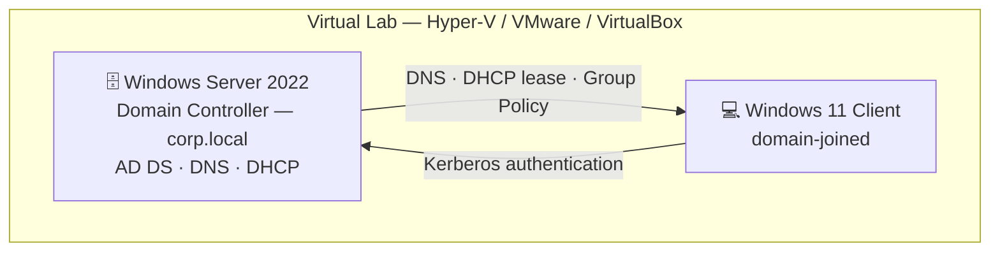

# 🖥️ Active Directory Home Lab — Windows Server 2022

A self-built Windows domain environment that simulates a small-business IT setup: a Windows Server
2022 **Domain Controller** running **Active Directory, DNS and DHCP**, with a domain-joined Windows 11
client managed by **Group Policy** — plus a **PowerShell** script that automates new-user onboarding.

> Built to practise the day-to-day work of an IT Support / Systems Administrator: managing users,
> groups, permissions and policies, and automating the repetitive parts.

---

## 🏗️ Architecture



---

## 🎯 Skills demonstrated

`Active Directory` · `Group Policy (GPO)` · `DNS` · `DHCP` · `Windows Server 2022` ·
`Windows 11` · `PowerShell automation` · `Virtualization` · `NTFS permissions` · `File sharing`

---

## 🧰 Lab environment

| Component | Detail |
|-----------|--------|
| Hypervisor | Hyper-V / VMware Workstation / VirtualBox |
| Server | Windows Server 2022 (Evaluation) — Domain Controller |
| Client | Windows 11 (Evaluation) — domain-joined |
| Domain | `corp.local` |
| Network | Private/internal switch, `192.168.10.0/24` |
| DC IP | `192.168.10.10` (static) |
| DHCP scope | `192.168.10.100 – 192.168.10.200` |

---

## ✅ What I built

- **Promoted a Domain Controller** — installed the AD DS role and created a new forest (`corp.local`).
- **DNS** — configured automatically with AD DS; verified forward/reverse lookups.
- **DHCP** — installed the role, authorised it in AD, and created a working scope for clients.
- **Organisational Units & structure** — OUs per department (Sales, IT, HR, Finance).
- **Users & groups** — created accounts and department security groups; applied least-privilege
  membership.
- **Group Policy** — enforced a password policy, mapped a network drive, and applied a desktop
  restriction to the client.
- **File share** — created a shared folder secured with NTFS + share permissions by group.
- **Domain join** — joined a Windows 11 client and confirmed policies and DHCP applied.
- **Automation** — wrote `New-BulkADUsers.ps1` to create users, OUs and groups from a CSV.

---

## ⚡ Featured automation: `New-BulkADUsers.ps1`

Onboarding ten new starters by hand is slow and error-prone. This script reads a CSV and, for each
person, creates the department OU and security group (if missing), creates the user with a UPN and a
"must change password at next logon" flag, and adds them to their team group — safely, with
`-WhatIf` support and duplicate checks.

```powershell
.\New-BulkADUsers.ps1 -CsvPath .\users.csv -Domain corp.local -OUPath "DC=corp,DC=local" -WhatIf
```

See [`scripts/New-BulkADUsers.ps1`](scripts/New-BulkADUsers.ps1) and the sample
[`scripts/users.csv`](scripts/users.csv).

---

## 📸 Screenshots

> _Add your own screenshots here as you build — recruiters love seeing the real thing._

| | |
|---|---|
| Server Manager — roles installed | `docs/screenshots/server-manager.png` |
| Active Directory Users and Computers | `docs/screenshots/aduc.png` |
| DHCP scope with active leases | `docs/screenshots/dhcp.png` |
| Group Policy Management | `docs/screenshots/gpo.png` |
| Script output creating users | `docs/screenshots/script-run.png` |

---

## 🧠 What I learned

- How AD, DNS and DHCP depend on each other and why the DC points DNS at itself.
- The difference between **share** and **NTFS** permissions, and how they combine.
- How Group Policy is processed and how to troubleshoot it with `gpupdate` / `gpresult`.
- Writing **idempotent** PowerShell (safe to re-run) using existence checks and `-WhatIf`.

## 🚀 Next steps
- Add a second DC and test replication.
- Integrate with the [Help Desk / Ticketing project](../) for an end-to-end "new starter" workflow.
- Push monitoring (Uptime Kuma / Zabbix) onto the lab.

---

## 📂 Repo structure
```
ad-home-lab/
├── README.md
├── docs/
│   └── build-guide.md        # full step-by-step build
└── scripts/
    ├── New-BulkADUsers.ps1   # bulk onboarding automation
    └── users.csv             # sample input
```

## ▶️ Publish this to GitHub
```bash
cd ad-home-lab
git init
git add .
git commit -m "Active Directory home lab + PowerShell onboarding automation"
git branch -M main
git remote add origin https://github.com/<your-username>/ad-home-lab.git
git push -u origin main
```
Then **pin the repo** on your GitHub profile and add it to LinkedIn → Featured.
